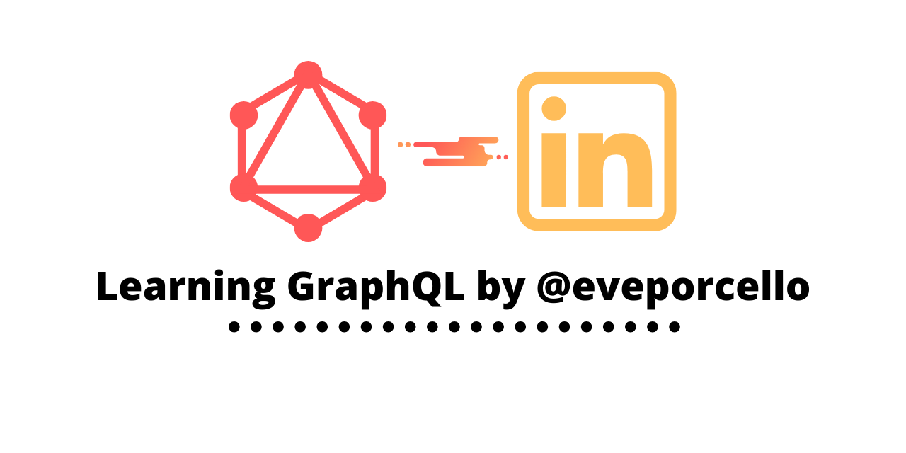

# gh-graphql
Explored the [GraphQL explorer](https://developer.github.com/v4/explorer/) by GitHub. Special thanks to @eveporcello for the great course on LinkedIn ["Learning GraphQL"](https://www.linkedin.com/learning/learning-graphql).

This course covers some of basics of GraphQL like:

- arguments
- query, schema
- variable
- alias
- mutation
- pagination
- nested query
